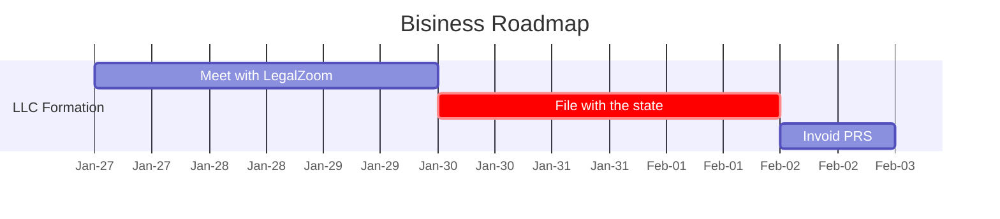

# Business Solutions that learn from you

Help us help you

Diagram: a Mermaid gannt chart plotting the time frame of project rollout

* PRS repo
  * AWS CodeCommmit permissions/access
* PRS Report design or image
* https://retirementtaxanalyzer.com/roadmap/rtaregister.html
* https://roadmappartners.net/bank-data-statistics/
* https://banks.data.fdic.gov/bankfind-suite/financialreporting/details/3510?establishedEndRange=1%2F4%2F2023&establishedStartRange=01%2F01%2F1792&inactiveEndRange=1%2F4%2F2023&inactiveStartRange=01%2F01%2F1970&incomeBasis=YTD&institutionType=banks&limitEstablishedDate=false&limitInactiveDate=false&reportPeriod=20220930&reportType=assets-liabilities-and-capital&unitType=%24

## Eight Issues Forming an LLC

1. Should be Manager Managed, not member managed.
2. No Forced Distributions